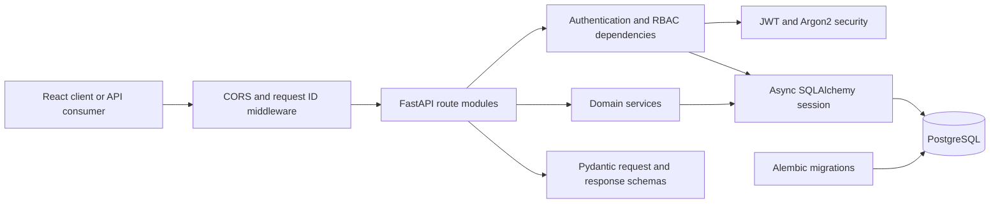

# Architecture

Team Workspace uses a modular monolith. A single deployable API owns one
transactional PostgreSQL database, while application modules keep domain boundaries
explicit.

## Module Responsibilities

| Module | Responsibility |
| --- | --- |
| `api/routes` | HTTP semantics, status codes, and endpoint orchestration |
| `schemas.py` | Input validation and public response contracts |
| `models.py` | Relational schema, constraints, indexes, and enums |
| `dependencies.py` | Database injection, authentication, and authorization |
| `security.py` | Password hashing and JWT creation/validation |
| `services.py` | Reusable domain rules and task relationship updates |
| `errors.py` | Stable client-facing error contract |
| `middleware.py` | Request correlation IDs |
| `database.py` | Async engine and transaction-scoped sessions |

## Request Lifecycle

1. Middleware assigns or preserves a request ID.
2. Pydantic validates and normalizes the request.
3. The authentication dependency validates the bearer access token.
4. Resource dependencies verify organization membership and minimum role.
5. A route coordinates domain work through one database session.
6. The transaction commits only after all invariants pass.
7. Pydantic serializes the public response without exposing internal fields.

## Transaction Boundaries

Each write endpoint performs related changes in one transaction. For example, task
creation inserts the task, validates assignees and labels, and creates association
rows before a single commit. A failure rolls the whole operation back.
