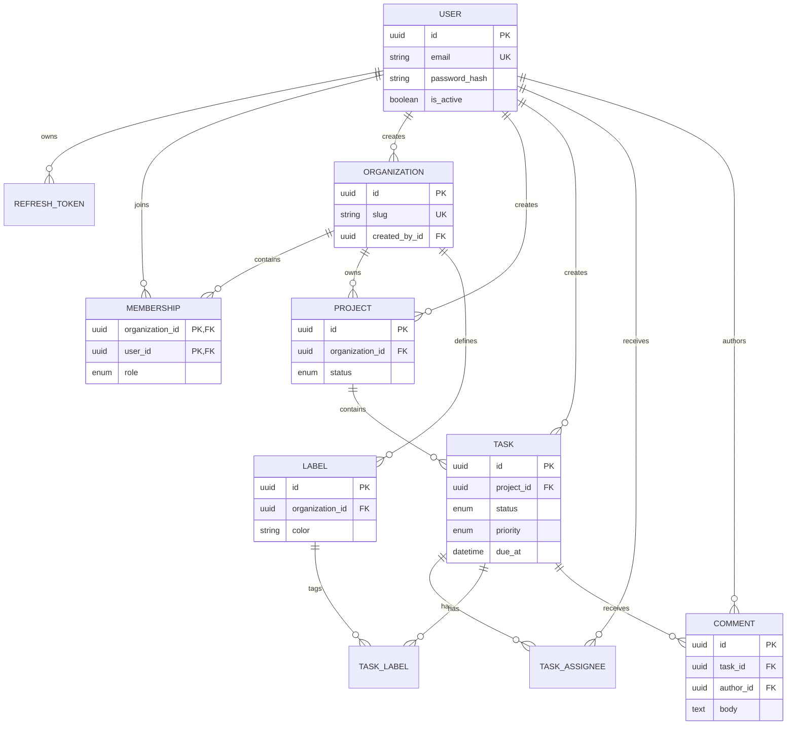

# Database Model

## Important Constraints

- Emails and organization slugs are globally unique.
- Project names and label names are unique inside an organization.
- Memberships, assignments, and task-label links use composite primary keys.
- Foreign keys use cascading deletes only for true ownership relationships.
- Role, status, and priority values have database check constraints.
- The application protects the last organization owner as a transactional rule.

## Important Indexes

- User email and refresh-token JTI for authentication lookups
- Membership user/organization for tenant access
- Project organization/status for project lists
- Task project/status/priority for common dashboard filters
- Task assignee user/task for personal work queues
- Comment task/created timestamp for chronological pagination
